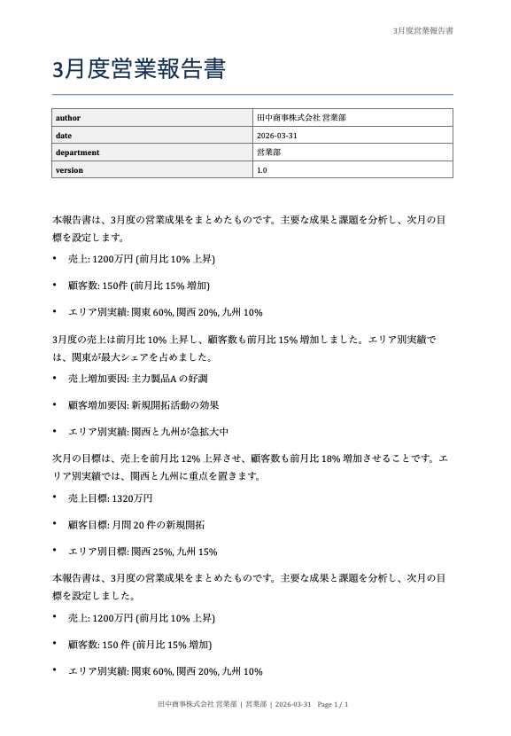

# office-agent


完全オフライン動作する Microsoft Office 文書生成 AI エージェント。

ローカル LLM（Ollama / llama.cpp）を使い、自然言語の指示から docx / xlsx / pptx を生成します。

---

## 特徴

- **完全オフライン**: インターネット接続不要
- **差し替え可能な LLM バックエンド**: Ollama / llama.cpp / Mock
- **セキュア**: ToolRegistry ホワイトリスト・ファイル読み取りサンドボックス
- **検証済み更新**: SHA-256 署名付き更新パッケージ

---

## セットアップ

### 必要要件

- Python 3.10 以上
- [Ollama](https://ollama.com/) (推奨) または llama.cpp

### インストール

```bash
git clone <repo>
cd office-agent
python -m venv .venv
source .venv/bin/activate  # Windows: .venv\Scripts\activate
pip install -e ".[dev]"
```

### Ollama セットアップ（推奨）

```bash
# 1. インストール（macOS）
brew install ollama
# または https://ollama.com/download からダウンロード

# 2. サーバ起動（バックグラウンド）
ollama serve &

# 3. モデル取得（約2GB、初回のみ）
ollama pull llama3.2:3b

# 4. 動作確認
office_agent run --task "月次報告書をWordで作って" --out ./out
office_agent run --task "売上集計Excelを作って" --out ./out
office_agent run --task "製品紹介プレゼンを3枚作って" --out ./out
```

---

## 使い方

```bash
# ヘルプ
office_agent --help

# モックバックエンドで動作確認（LLM不要）
office_agent run --task "簡単な報告書をWordで作って" --backend mock --out ./out

# Ollama で Word 文書生成
office_agent run --task "月次売上報告書をWordで作って" --out ./out

# Ollama で Excel 生成
office_agent run --task "売上集計ExcelをSUM数式付きで作って" --out ./out

# Ollama で PowerPoint 生成
office_agent run --task "製品紹介プレゼン3枚を作って" --out ./out
```

---

## 設定

`office_agent/config.py` または環境変数で設定：

| 変数 | デフォルト | 説明 |
|------|-----------|------|
| `OFFICE_AGENT_BACKEND` | `ollama` | LLMバックエンド (`ollama`/`llamacpp`/`mock`) |
| `OFFICE_AGENT_MODEL` | `llama3.2:3b` | 使用モデル名 |
| `OFFICE_AGENT_OLLAMA_URL` | `http://localhost:11434` | Ollama サーバ URL |
| `OFFICE_AGENT_LLAMACPP_URL` | `http://localhost:8080` | llama.cpp サーバ URL |
| `OFFICE_AGENT_OUT_DIR` | `./out` | 出力ディレクトリ |
| `OFFICE_AGENT_ALLOWED_READ_DIRS` | `./,/tmp` | ファイル読み取り許可ディレクトリ |
| `OFFICE_AGENT_OLLAMA_JSON_FORMAT` | `true` | Ollama の JSON 強制モード（`false` で無効化） |

---

## テスト

```bash
pytest tests/ -v
pytest tests/ -v --cov=office_agent
```

---

## 更新システム

```bash
# オンライン端末: 更新パッケージ作成
office_agent package-update --version 0.2.0 --out update_packages/

# オフライン端末: 検証
office_agent verify-update update_packages/office_agent_0.2.0.tar.gz

# オフライン端末: 適用
office_agent apply-update update_packages/office_agent_0.2.0.tar.gz
```

---

## プロジェクト構成

```
office-agent/
├── office_agent/          # メインパッケージ
│   ├── agent/             # オーケストレータ
│   ├── llm/               # LLM アダプタ層
│   ├── tools/             # Office 生成ツール
│   ├── schemas/           # JSON スキーマ
│   └── update/            # 更新システム
├── templates/             # Office テンプレート
├── tests/                 # テスト
└── out/                   # 生成物出力先
```

## ライセンス

MIT
## Demo / デモ

### Input

```
月次営業報告書をWordで作って
```

### Output



This document was generated entirely offline using a local LLM.

No internet connection was used. No data was sent externally.
